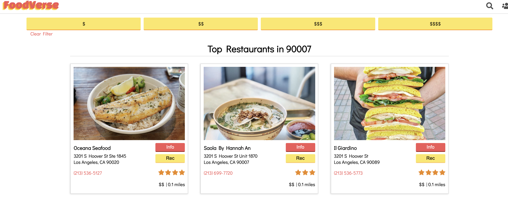

# **foodVerse**

A food listings project utilizing YELP’s API - [http://foodverse.herokuapp.com/]

## **Description**
FoodVerse is a project utilizing YELP’s API and a filtering system to exclude chains and expel them from users search results. The user will simply need to enter an address to be presented with a list of up to 100 restaurants ordered from closest to furthest restaurant based on the address given. Furthermore, a user who chooses to log on with their snapchat ID can select a restaurant of their choice to recommend the restaurant to their friends. list of Features or a Background subsection can also be added here. If there are alternatives to your project, this is a good place to list differentiating factors.

  

## **Requirements**
* Homebrew; a free open-source software management package
* Heroku command line interface to facilitate managing your Heroku applications from a terminal
* Node package manager for JavaScript programming

## **Technologies Used**
* HTML5
* CSS3
* JavaScript
* Node.js
* Express
* Yelp API Endpoints

## **Usage**
* Find restaurants without running into chains/franchises
* Filter restaurants through pricing filters from more user control
* Restaurant recommendation feature between users in a group

## **Roadmap**
Final versions of the project will include:
* Polling system between friend groups to choose a restaurant
* Snap authentication for bitmoji avatar markers next to user selection
* Snap selfie with snap filter next to your recommendation 
* Users may leave a review that will be hosted on foodVerse 

## **Future Features**
* Snap Kit AUTH
   
   * Users will need snapKit to log in (since this is a snap mini) and if they decline, they may use a “guest” profile, but cannot use the suggest functionality
   * SnapKit Auth will display their bitmoji while they browse, and keep track of their suggestions using the SnapKit info
   * On the snap Mini, the current “session” will involve all currently logged in snap users on the current group chat. Suggest functionality will only be between those 

* Suggestions

   * Each user in the current group chat on snap can use the app within the same session, where they can each suggest a restaurant they’d like to eat at.
   * On the Suggest viewing page, the users in the current session can vote on which restaurant they’d like to eat at

* Filters
   
   * Users can take a picture with a filter showing their suggestion and send it to the group so other users can view suggestions
   * If a restaurant is chosen to go to, then users can take a picture with a different filter at the restaurant
   * The user can also take a picture of their food at the restaurant and save that within our app, so when future users look at the website they can see past snaps located at that restaurant

## **Authors and acknowledgment**
Giovanni Quevedo, Grace Park, and Hassan Aziz Elnasri

## **License**
MIT License

Copyright (c) [2020] [Grace Park, Giovanni Quevedo, Hassan Aziz Elnasri]

Permission is hereby granted, free of charge, to any person obtaining a copy
of this software and associated documentation files (the "Software"), to deal
in the Software without restriction, including without limitation the rights
to use, copy, modify, merge, publish, distribute, sublicense, and/or sell
copies of the Software, and to permit persons to whom the Software is
furnished to do so, subject to the following conditions:

The above copyright notice and this permission notice shall be included in all
copies or substantial portions of the Software.

THE SOFTWARE IS PROVIDED "AS IS", WITHOUT WARRANTY OF ANY KIND, EXPRESS OR
IMPLIED, INCLUDING BUT NOT LIMITED TO THE WARRANTIES OF MERCHANTABILITY,
FITNESS FOR A PARTICULAR PURPOSE AND NONINFRINGEMENT. IN NO EVENT SHALL THE
AUTHORS OR COPYRIGHT HOLDERS BE LIABLE FOR ANY CLAIM, DAMAGES OR OTHER
LIABILITY, WHETHER IN AN ACTION OF CONTRACT, TORT OR OTHERWISE, ARISING FROM,
OUT OF OR IN CONNECTION WITH THE SOFTWARE OR THE USE OR OTHER DEALINGS IN THE
SOFTWARE.

